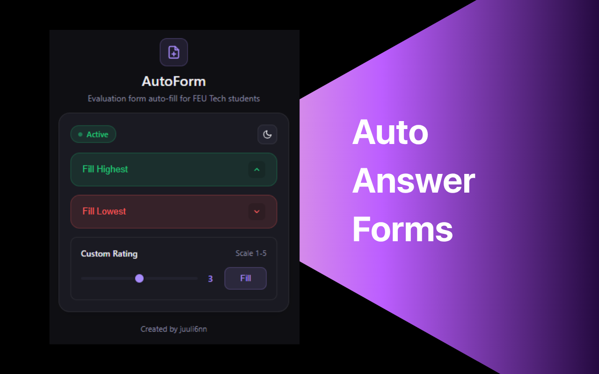

<div align="center">

# AutoForm  
### FEU Tech Evaluation Auto-fill Extension



**Streamline your FEU Tech teacher evaluations with one click**

<br>

[](https://chrome.google.com/webstore)
[](manifest.json)

</div>


---

## 📖 About

AutoForm is a Chrome extension designed specifically for FEU Tech students to simplify the teacher evaluation process. Instead of manually clicking through dozens of rating questions, complete your evaluations in seconds with automated form filling.

## ✨ Features

- **🚀 Fill Highest** - Automatically apply 5-star ratings to all fields
- **📉 Fill Lowest** - Automatically apply 1-star ratings to all fields
- **🎯 Custom Rating** - Choose any rating (1-5) and apply it to all fields
- **🌓 Dark Mode** - Automatic theme switching based on system preference
- **⚡ Instant Feedback** - Visual confirmation when forms are filled
- **🎨 Modern UI** - Clean, professional interface with smooth animations


## 🚀 Installation

### From Chrome Web Store (Recommended)
1. Visit the [Chrome Web Store page](#) (link coming soon)
2. Click "Add to Chrome"
3. Confirm the installation

### Manual Installation (Developer Mode)
1. Download or clone this repository
   ```bash
   git clone https://github.com/yourusername/autoform.git
   ```
2. Open Chrome and navigate to `chrome://extensions/`
3. Enable "Developer mode" (toggle in top-right corner)
4. Click "Load unpacked"
5. Select the `autoform` folder
6. The extension is now installed!

## 📝 How to Use

1. Navigate to your FEU Tech teacher evaluation form:
   ```
   https://solar.feutech.edu.ph/online/faculty/evaluation
   ```
2. Click the AutoForm extension icon in your Chrome toolbar
3. Choose your preferred option:
   - **Fill Highest** - For 5-star ratings
   - **Fill Lowest** - For 1-star ratings
   - **Custom Rating** - Use the slider (1-5) and click "Fill"
4. Your evaluation form is filled instantly!
5. Review and submit your evaluation

## 🛠️ Tech Stack

- **HTML5** - Structure
- **CSS3** - Styling with CSS custom properties for theming
- **Vanilla JavaScript** - No frameworks, pure JS
- **Chrome Extension Manifest V3** - Latest extension standard

## � Privacy & Security

- ✅ **No data collection** - Your information stays private
- ✅ **No external servers** - Everything runs locally in your browser
- ✅ **Minimal permissions** - Only accesses FEU Tech evaluation pages
- ✅ **Open source** - Code is transparent and auditable

## 🤝 Contributing

Contributions are welcome! Here's how you can help:

1. Fork the repository
2. Create a feature branch (`git checkout -b feature/AmazingFeature`)
3. Commit your changes (`git commit -m 'Add some AmazingFeature'`)
4. Push to the branch (`git push origin feature/AmazingFeature`)
5. Open a Pull Request

### Development Setup

```bash
# Clone the repository
git clone https://github.com/yourusername/autoform.git

# Navigate to the project directory
cd autoform

# Load the extension in Chrome (Developer Mode)
# chrome://extensions/ > Load unpacked > Select folder
```

## 🐛 Bug Reports & Feature Requests

Found a bug or have a feature idea? Please open an issue on GitHub:

1. Go to the [Issues](https://github.com/yourusername/autoform/issues) page
2. Click "New Issue"
3. Describe the bug or feature request in detail

## ⚠️ Disclaimer

This extension is created by FEU Tech students to help streamline the evaluation process. Please use it responsibly and provide honest feedback to help improve the quality of education at FEU Tech.


## 👨‍💻 Author

- GitHub: [@yourusername](https://github.com/juuli6nn)

## 🙏 Acknowledgments

- Built for FEU Tech students, by FEU Tech students
- Inspired by the need to save time during evaluation periods
- Thanks to all contributors and users!

---

<div align="center"> 
  **If you find this helpful, please ⭐ star this repository!**
</div>
